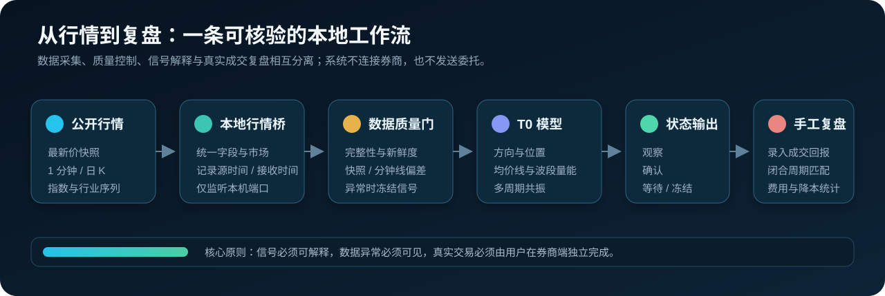
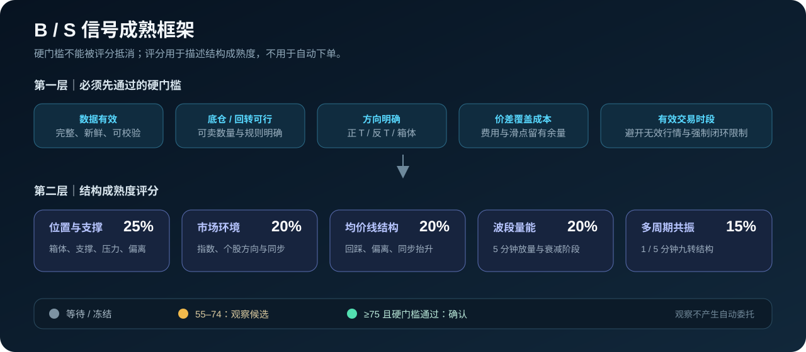
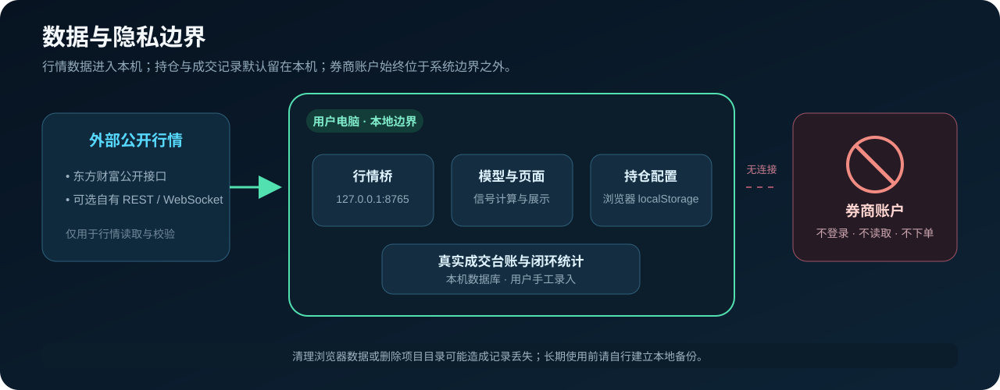

# 分时罗盘

**面向 A 股与场内 ETF 持仓管理的开源、只读式分时决策辅助与日内做 T 复盘工具。**

🌐 **网站访问地址：[00t00.com](https://00t00.com/)**

项目将行情监测、数据质量控制、B/S 结构成熟度、真实成交台账和闭环复盘整合在同一套本地应用中。用户输入证券代码和持仓信息后，即可查看公开行情与模型状态，并根据券商成交回报手工记录实际操作。

> **系统边界**：分时罗盘不连接券商账户、不读取资金、不发送交易委托。模型输出属于研究辅助，不构成投资建议；实盘数据和交易规则应始终以券商终端为准。

## 项目背景

持仓成本较高时，部分投资者会尝试利用日内价格波动进行正 T、反 T 或箱体 T，以改善持仓成本。但实际执行并不只是寻找一个“买点”或“卖点”，还需要同时处理以下问题：

- 行情、均价线、成交量、指数环境和持仓数据分散，难以形成统一判断；
- 急涨急跌容易触发情绪化决策，单一指标也容易产生误判；
- A 股回转规则、可卖数量、交易费用和闭环时段会直接影响策略可执行性；
- 若缺少成交台账，事后无法准确判断一次做 T 是否真正降低了成本。

分时罗盘将日内 T0 课程中的趋势、均价线、量能阶段、九转和指数环境等方法转化为可解释的状态机，并把数据校验、信号观察、手工成交记录和闭环统计串联起来。项目目标不是预测每一次短期涨跌，而是提供一套可复核、可追踪、可持续改进的研究流程。

## 设计目标

项目围绕四项原则设计：

1. **信息集中**：统一展示价格、均价线、成交量、指数环境、持仓状态和信号成熟度。
2. **条件先行**：先验证数据、交易规则、方向、价差和时段，再进入结构评分，避免用高分掩盖硬性风险。
3. **过程留痕**：真实成交仅由用户依据券商回报手工录入，并区分已闭合与未闭合周期。
4. **结果可核验**：按实际成交价格、数量和费用计算差价、成本影响与闭合周期成功率。



## 核心能力

- 同时追踪多只 A 股或场内 ETF；
- 查看最新价、1 分钟 K 线、分时均价线、成交量和上证指数环境；
- 查看 B 点、S 点的观察、确认、等待和冻结状态，并展开具体判断依据；
- 在行情陈旧、分钟线不完整或校验失败时自动冻结信号；
- 依据券商成交回报手工记录真实买卖，并更新持仓成本；
- 统计闭合做 T 周期的差价、费用、成本影响和成功率；
- 在电脑或手机浏览器中使用；
- 可选同步到 M5Stack StopWatch，或查看可转债同步雷达。

当前版本定位为个人研究与公开测试工具，适合需要分时监测、手工台账和策略复盘的持仓用户；不适合作为高频交易终端、交易所级行情终端或无人值守自动交易系统。

## 快速开始

### Windows 首次使用

运行环境只要求 [Node.js 22 或更高版本](https://nodejs.org/)。项目不依赖 Python、Tushare 或个人行情 API Key。

1. 点击 GitHub 页面右上方绿色的 **Code** 按钮。
2. 点击 **Download ZIP**，下载后解压到一个固定文件夹。
3. 打开解压后的文件夹，双击 `start-local.cmd`。
4. 第一次运行会自动安装依赖，耐心等待命令窗口显示本地访问地址。
5. 浏览器打开 <http://localhost:4173/>。

再次使用时只需双击 `start-local.cmd`。运行期间请保留命令窗口，以便网页和本地行情桥持续工作。

### macOS / Linux

```bash
git clone https://github.com/MitziTung-CIINC/intraday-compass.git
cd intraday-compass
chmod +x start-local.sh
./start-local.sh
```

开发者也可以手动启动：

```bash
corepack pnpm install
corepack pnpm run local
```

## 首次配置持仓

页面首次打开时会显示“管理监测股票”。按以下顺序配置：

1. 输入证券名称，例如“贵州茅台”或“沪深 300 ETF”。
2. 输入 6 位证券代码，系统会自动识别沪市、深市或北交所。
3. 填写目前持仓股数、今日可卖数量和持仓成本。
4. 股票通常选择 **T+1**。只有已经确认支持当日回转的 ETF 才选择 **T+0**。
5. 点击“添加并追踪”。

添加后可在左侧列表继续新增、修改或删除证券。持仓配置仅用于本地监测，不会同步到 GitHub。

## B / S 信号如何解释？

- **B 点**：出现偏向低位买入或卖出后买回的结构候选。
- **S 点**：出现偏向高位卖出或买入后兑现的结构候选。
- **观察**：部分条件已经形成，但成熟度或硬门槛尚未全部满足。
- **确认**：结构成熟度达到阈值，且数据、方向、价差、回转条件和时段门槛均通过。
- **冻结**：行情过期、关键数据缺失或质量校验失败，模型暂停输出 B/S 判断。

“确认”只表示模型条件已经满足，不表示收益确定，也不构成交易指令。

模型主要观察五类信息：

```text
位置与支撑 25%
+ 指数与个股环境 20%
+ 分时均价线结构 20%
+ 5 分钟波段量能 20%
+ 1 / 5 分钟九转共振 15%
```

量能候选默认达到 55 分开始提示，普通候选默认达到 60 分开始提示；成熟度达到 75 分且硬门槛全部通过时，才升级为确认。MACD 和板块信息只作辅助，不单独决定信号。



## 真实成交台账与闭环复盘

“记录真实买入 / 卖出”是成交台账功能，不是模拟委托或自动下单。建议按以下流程使用：

1. 先在自己的券商软件中完成交易；
2. 根据成交回报，把成交方向、数量、价格和费用手工填入分时罗盘；
3. 系统按照同一证券的买卖记录匹配闭合周期；
4. 只有买卖数量已经闭合，才会计入做 T 成功率；
5. 未买回或未卖完的记录会单独显示，不会被误算成成功交易。

该口径能够避免只统计有利的一侧成交，并将买回价格、卖出价格、费用和持仓变化纳入同一闭环。

## 行情数据与质量控制

项目自带仅监听本机地址的行情桥：

```text
http://localhost:8765/quote?symbol={symbol}&market={market}
```

默认使用无需个人密钥的东方财富公开行情接口：

- 快照接口：更新最新价；
- `trends2`：读取当日 1 分钟 K 线、市场指数和股票行业板块分钟线；
- `kline`：读取多日日 K 数据。

ETF 会使用自身分钟线、日 K 和对应市场指数。免费接口无法可靠识别 ETF 跟踪指数时，页面会明确显示该辅助项不可用，不会用大盘数据冒充。

公开接口可能发生延迟、限流、字段变更或停止服务，且不属于交易所直连逐笔行情。页面显示的“源站 xx ms”仅代表本次请求耗时，不代表行情相对交易所的真实延迟。数据不完整、过期或校验失败时，页面可以继续展示最新价，但会冻结 B/S 判断。

更详细的数据结构和健康检查说明见 [`docs/hybrid-market-data.md`](docs/hybrid-market-data.md)。

### 接入东方财富、同花顺或券商 L2

如果用户已经取得数据服务商正式授权的 API、SDK 或行情网关权限，可以替换成自己的实时行情源。普通桌面端或手机端 L2 会员不等于 API 权限，也不能通过抓包或复用客户端账号接入。

项目支持两条路径：

- 简单最新价接口：可在“行情配置”中直接填写 REST 或 WebSocket 地址和字段路径；
- 完整 B/S 模型：推荐用本地适配器保管密钥，并统一输出最新价、分钟 K、日 K、指数/板块序列和校验结果。

完整的权限确认、字段映射、标准 JSON、数据校验、安全配置和上线验收流程见 [`docs/l2-market-data-integration.md`](docs/l2-market-data-integration.md)。仓库不会包含任何用户自己的付费行情密钥。

## 本地数据与隐私边界

- 追踪证券和持仓配置保存在当前浏览器的 `localStorage`；
- 手工成交记录保存在项目目录中的本机数据库；
- 数据不会自动上传到 GitHub，也不会发送给其他测试者；
- 清理浏览器数据或删除整个项目文件夹，可能导致记录丢失。

如需长期使用，建议定期备份本地记录。请勿将包含真实持仓或成交记录的数据库提交到公开仓库。



## 使用 Codex Skill 安装和维护

仓库内置了可以单独安装的 [`intraday-compass` Skill](skills/intraday-compass/SKILL.md)。它可以帮助 Codex 安装、启动、检查行情连接和维护本项目，但同样不会连接券商或执行交易。

在 Codex 中可以直接说：

```text
请从 https://github.com/MitziTung-CIINC/intraday-compass/tree/main/skills/intraday-compass 安装 intraday-compass Skill
```

安装后可使用 `$intraday-compass` 调用。

## 可选：同步到 M5Stack StopWatch

刷入配套固件后，可以把最多 8 只持仓、18 根 1 分钟 K 线和当前 B/S 成熟度同步到手表：

1. 首次使用时连接手表的 `Compass-xxxx` 热点；
2. 访问 `http://192.168.4.1`，填写 2.4 GHz Wi-Fi；
3. 让电脑和手表处于同一局域网；
4. 在页面右上角“行情配置 → StopWatch 硬件同步”中填写设备地址和固件的 `DEVICE_API_KEY`；
5. 点击“检测设备”，确认成功后开启同步。

默认设备地址可尝试 `http://intraday-compass.local`，也可以使用手表屏幕显示的局域网 IP。

## 可选：转债同步雷达

启动应用后访问 <http://localhost:4173/bond-radar>，可以查看可转债与正股向上联动的候选结果。雷达会过滤成交不活跃、趋势不同步或带 ST / 退市风险标识的组合，并保留波动、活跃度、联动弹性和转换溢价率等复核字段。


手动更新数据：

```bash
corepack pnpm run bond:update
```

采集失败时脚本会直接报错，不会生成伪造行情。

## 常见问题

### 本地页面无法访问

先确认 `start-local.cmd` 的命令窗口没有关闭，再访问：

- 页面：<http://localhost:4173/>
- 行情健康检查：<http://localhost:8765/health>

若健康检查同样无法访问，通常表示行情桥尚未启动，或 8765 端口被其他程序占用。

### 页面有最新价，但没有 B / S 提示

常见原因包括行情已经过期、分钟线不完整、快照与分钟线偏差过大、价差不足，或者信号仍处于观察阶段。页面会显示冻结或等待原因。

### 场内 ETF 支持范围

项目支持场内 ETF 的行情监测和成交记录，但能否执行 T+0 取决于具体产品。请以券商交易规则和基金法律文件为准，不应仅凭证券代码判断。

### 是否支持自动交易？

不会。项目没有券商登录、资金读取或自动下单功能。

## 测试与反馈

项目目前处于持续迭代阶段。提交 GitHub Issue 时，建议附上：

- 操作系统和 Node.js 版本；
- 证券代码；
- 页面显示的完整错误文字；
- <http://localhost:8765/health> 是否能打开；
- 可以重复问题的操作步骤。

请不要上传券商账号、手机号、资产截图、交易密码、短信验证码或任何 API Key。

仓库内置 GitHub Actions，每次提交和 Pull Request 都会执行构建与页面测试。欢迎提交缺陷报告、改进建议和 Pull Request。

## 重要风险说明

- 本项目不连接券商，不读取资金，不发送交易委托；
- B/S 信号和成熟度只是研究辅助，不构成投资建议；
- 做 T 可能出现卖飞、补仓后继续下跌、无法当日闭合和费用超过价差等风险；
- 做 T 成功率只统计已经闭合的买卖周期，并扣除手工录入的费用；
- 场内 ETF 的回转规则必须由用户自行确认；
- 免费公开行情没有交易所授权实时等级或持续可用性保证；
- 实盘操作请始终以券商终端显示的数据和交易规则为准。
